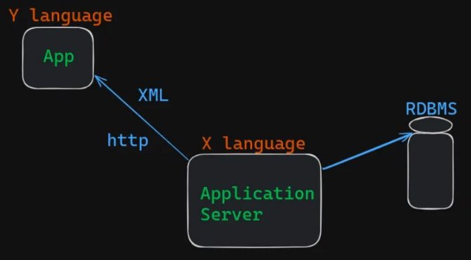
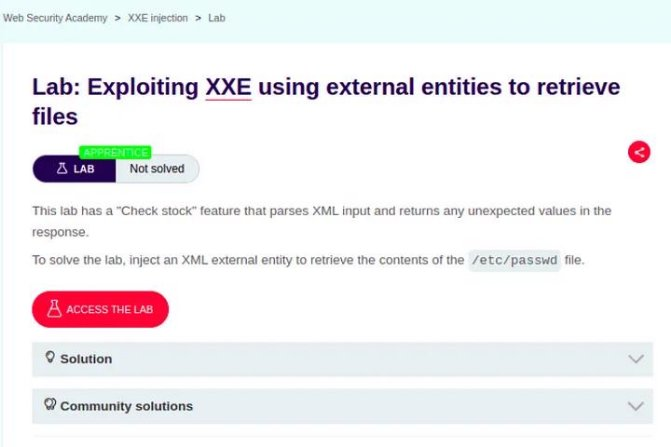
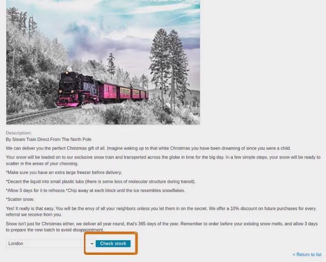
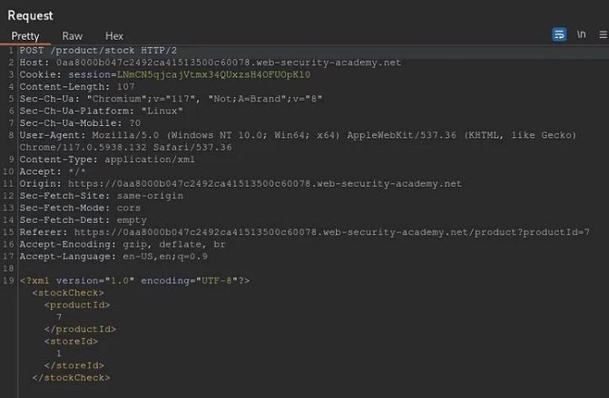
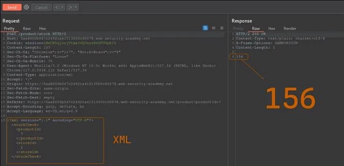
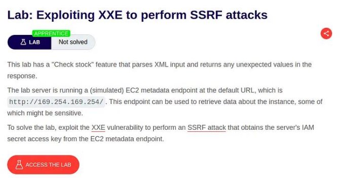
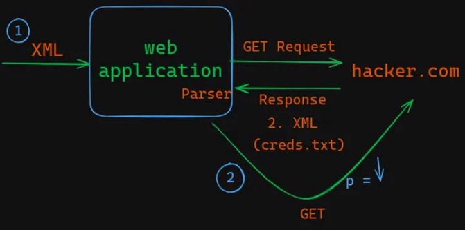
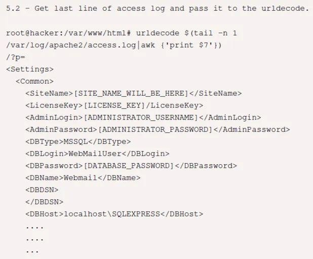
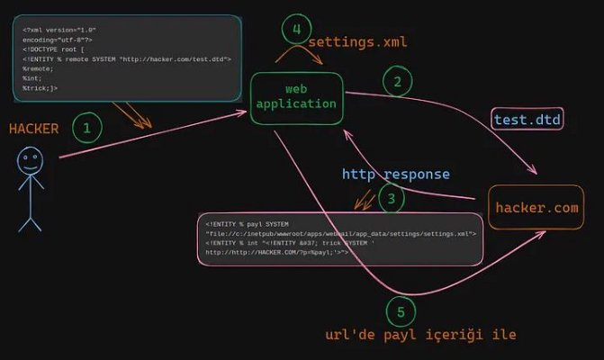

[Open in app ](https://rsci.app.link/?%24canonical_url=https%3A%2F%2Fmedium.com%2Fp%2Ffaedd1a65461&%7Efeature=LiOpenInAppButton&%7Echannel=ShowPostUnderUser&source=---two_column_layout_nav----------------------------------)

XML Parserlar ve XML External Entity (XXE) Injection | MDISEC Neler Anlattı #6

XML (Extensible Markup Language) Nedir ?

Günümüz programlama dillerini öğrenirken işin içerisinde veritabanını da çoktan öğreniyoruz. Hepimiz günümüzde yeni bir programlama dilini öğrendiğinde

temelde ilişkisel bir veritabanı ile başlamakta. İlişkisel veritabanı yani Relational Database Management System (RDBMS) olarak kabul edilmektedir. MySQL, PostgreSQL, MSSQL, Oracle, Sqlite gibi veritabanları örnek olarak verilebilir. Bu tür veritabanları olduğu için verileri saklayabileceğiniz çok düzgün yapısal veri mekanizmaları var ve bunları kullanmaktasınız.

Biraz daha geriye gittiğimizde HTML’e benzeyen ancak temelde farklı olan XML ile ![ref1]karşılaşmaktayız. XML’in bize sağladığı temel şey ise bu verileri bir formatta tutabilmemizi sağlamasıdır.

<xml >   

`  `<user s>

`    `<user >

`     `<name>Mehmet </ name>     </ user >

`    `<user >

`     `<name>Ahmet </ name>     </ user >

`    `<user >

`     `<name>Deni z</ name>     </ user >

`   `</ user s>

</ xml >

XML’in tarihçesine baktığımızda 1996'da ortaya atıldığını görebiliriz. Yazılım geliştiricinin doğrudan aktif olarak kullandığı bir şey olmasa da başka servislerle etkileşimde kullanılan durumlar vardır günümüzde. Orada da karşımıza artık JSON çıkmaktadır.

XML, structural (yapısal) tutulan bir veriyi başka bir ortama taşırken kullanılan bir Extensible Markup Language olarak açılan bir formattır.

Programlama Dillerinde XML Parsing

Bu tarz imkanlar olduğu için programlama dillerinde bu XML’i parse edebilmenizi sağlayan kütüphaneler bulunmaktadır. Örneğin buradaki kod parçacığı sayesinde XML olarak tanımlanan veriyi bir dictionary’e çevirebilmekteyiz. Daha sonra da bu çevrilen veri üzerinden ilgili kısımlara erişebiliriz.

i mpor t  xml t odi ct

dat a  =  """

`            `<user s>

`                 `<user >

`                     `<name>Mehmet </ name>                  </ user >

`                 `<user >

`                     `<name>Ahmet </ name>                  </ user >

`                 `<user >

`                     `<name>Deni z</ name>                  </ user >

`             `</ user s>

`         `"""

a  =  xml t odi ct . par se( dat a) pr i nt ( a)

Kodu çalıştırdıktan sonra çıktımız şu şekilde olacaktır:![ref2]

Out put :

{' user s' :  {' user ' :  [ {' name' :  ' Mehmet ' },  {' name' :  ' Ahmet ' },  {' name' :  ' Deni z' }] }}

Gerçek Hayatta XML

Peki gerçek hayatta bu hikayeler karşımıza nasıl çıkar diye düşünelim. Aşağıda görmüş olduğunuz taslak hiyerarşide bir application, application server ve RDBMS yer almaktadır. Application Server’ın kendi verilerini sakladığı yer RDBMS’tir. Başka bir application ile verilerini paylaşmak istediğinde ise buradaki veriyi hangi formatta paylaşacağı akıllarda bir soru işaretidir. Çünkü Application Server örneğin X programlama diliyle, Application ise Y programlama diliyle yazılmış olabilir. Bu iki uygulamanın birbiriyle konuşabilmesi için aynı protokolü kullanması gerekir, Bu da HTTP’dir. Gönderilen verinin de iki tarafın anlayabileceği bir formatta olması gerekmektedir. XML’i kullanmaya başladığımız nokta burasıdır.

Application Security dediğimiz hikayenin çok büyük ve önemli bir kısmı hep input tracing’den geçer. Yani bir uygulamaya kullanıcıdan (dış dünyadan) gelen parametreler olabilir. Bu parametreler request’in header’ları da olabilir.

Uygulamaya dış dünyadan gelen şey input ise sizin başka bir servisten aldığınız data da input’tur. Bu açıdan baktığımızda XML günümüzde hala aktif bir şekilde kullanılmaktadır.

Sizin buradaki Web uygulamanız başka bir yerden XML aldığında soru işaretleri artmaya başlayacaktır. Çünkü aldığı bu XML’i parse etmesi gerekir. İnput validation yapılmak istense bile öncelikle parsing işlemini bitirmek gerekir. Bizim (hacker’ların) hedeflediğimiz yer ise halihazırda programlama dilinin parsing yaptığı andır.

XML DTD (XML Document Type Definition)

XML yapısında dinamik olarak da bazı işlemler yapmak isteyebiliriz. XML DTD kavramını incelememiz gerekmektedir. Aklımızda şöyle canlandıralım; XML’in içerisinde sadece user’lar ile değil farklı kısımlar da olabilir. Veritabanında bulunan genel şemayı XML’e yansıtırken sorunlar yaşanmaya başlayacaktır. Dinamik kısımlara da ihtiyacınız olacaktır. Dolayısıyla XML yukarıda bahsettiğimiz kadar basit bir formattan ibaret değildir. Bundan itibaren olmadığını anladığımız zaman da karşımıza XML’in içerisinde Document Type Definition yapabildiğimiz bir imkan çıkmaktadır. Kısaca DTD olarak kabul edilmektedir.

Örneğin burada bir örnek üzerinden değerlendirelim;![ref3]

Burada bu XML dosyasının bulunduğu konumla aynı yerde bulunan yani bu dosyanın yanındaki note.dtd adında bir doküman tanım formatı bulunmaktadır. Bu dosyanın içeriğinin okunması gerekmektedir. Çünkü XML’in içerisinde tanımlanacak olan verilerin hepsi note.dtd dosyasında tanımlanan XML formatı esas alınarak yazılacaktır.

<?xml  ver si on="1. 0"  encodi ng="UTF- 8"?>

<! DOCTYPE  not e  SYSTEM "Not e. dt d">

<not e>

<t o>Tove</ t o>

<f r om>Jani </ f r om>

<headi ng>Remi nder </ headi ng>

<body>Don' t  f or get  me  t hi s  weekend! </ body>

</ not e>

Buradaki note.dtd dosyamıza geldiğimizde ise elementlerin tanımlandığını görebiliriz. Örneğin ‘note’ isminde bir ELEMENT var ve bunun bazı alanları yani field’ları bulunmaktadır. Kalan elementlerin de bir string değer aldığını görmekteyiz. Bu da şu anlama gelmektedir; örneğin veritabanında ‘Users’ tablomuzda {id INT, username Mehmet} olarak ayarlamalar yaparız. Daha sonra programlama diliyle veritabanındaki şemayı kullanan bir programlama tanımı yapılır. ‘note.dtd’ kısmında da olay aynı şekilde gerçekleşir.

not e. dt d

<! DOCTYPE  not e

[

<! ELEMENT  not e  ( t o, f r om, headi ng, body) > <! ELEMENT  t o  ( #PCDATA) >

<! ELEMENT  f r om  ( #PCDATA) >

<! ELEMENT  headi ng  ( #PCDATA) >

<! ELEMENT  body  ( #PCDATA) >

] >

XML Parser Davranışları ve Yaptıkları

Bu aşamadan sonra XML Parser kendisine yukarıdaki gibi bir XML geldiğini gördüğü anda direktiflere bakar ve bir doctype definition olduğunu görür. Bu durumda XML Parser XML’i parse etmeye başlamadan önce burada verilen dosyaya gider ve içeriğini okur. Ardından o içerikte ne yazıyorsa bunu ‘note’ isimli objeyi oluşturmakta kullanır. Buradaki “note” içeriği “note.dtd” dosyasının içeriğine eşdeğer olur.

<?xml  ver si on="1. 0"  encodi ng="UTF- 8"?>

<! DOCTYPE  not e  SYSTEM "Not e. dt d">

<not e>

<t o>Tove</ t o>

<f r om>Jani </ f r om>

<headi ng>Remi nder </ headi ng>

<body>Don' t  f or get  me  t hi s  weekend! </ body> </ not e>

Burada artık neyi öğrenmiş oluyoruz?![ref2]

Güvensiz bir kaynaktan XML alıp bu XML’i parser’a verdiğinizde DOCTYPE özelliğinin SYSTEM operandı sayesinde XML Parser’a gidip sistemdeki herhangi bir locale dosyanın (yerel dosya) içeriğini okutma yeteneğine sahip oluruz. Bu noktada hacker’ın hikayesi bir feature’u suistimal etmeye dayanır.

Peki XXE Hikayesi Nasıl Başlamaktadır ?

Document Type içerisinde SYSTEM ile okunması gereken dosyayı belirtebilmektesiniz. Bu da ilgili dosyadaki elementleri include eder yani içe aktarır. Burada sadece dosya adı değil aynı zamanda string bir ifade de verebilmektesiniz. Burada şu şekilde bir yanımlama yapabilirsiniz; böyle bir ELEMENT tanımı yapabilmektesiniz.

<?xml  ver si on="1. 0"  encodi ng="UTF- 8"?>

<! DOCTYPE  not e  SYSTEM [ <! ELEMENT  not e  ( t o, f r om, headi ng, body) >] > <not e>

<t o>Tove</ t o>

<f r om>Jani </ f r om>

<headi ng>Remi nder </ headi ng>

<body>Don' t  f or get  me  t hi s  weekend! </ body>

</ not e>

Bu format bizim için mantıklı bir bakış açısı sağlar. XML’in içerisinde ayrıca ENTITY tanımlamaları da sağlayabilirsiniz. Örneğin burada “writer” isimli bir ENTITY oluşturup referansıyla çağırabilirsiniz.

DTD  Exampl e:

<! ENTI TY  wr i t er  "Donal d  Duck. ">

<! ENTI TY  copyr i ght  "Copyr i ght  W3School s. ">

XML  exampl e:

<aut hor >&wr i t er ; &copyr i ght ; </ aut hor >

Buradan hareketle artık XML yapımızı şu şekilde güncelleyelim;

burada artık “writer” ile referans verdiğimiz yerde “Donald Duck” yazılacaktır.

<?xml  ver si on="1. 0"  encodi ng="UTF- 8"?>

<! DOCTYPE  not e  SYSTEM [ <! ENTI TY  wr i t er  "Donal d  Duck. ">] > <not e>

<t o>&wr i t er ; </ t o>

<f r om>Jani </ f r om>

<headi ng>Remi nder </ headi ng>

<body>Don' t  f or get  me  t hi s  weekend! </ body>

</ not e>

Tüm bu feature’ların ve özelliklerin yanında ENTITY, SYSTEM operandına erişime sahiptir. Dolayısıyla şu şekilde bir şey yapabiliriz artık;

Artık iş bu noktaya geldiğinde ise hacker bakış açısıyla bir şeyler yapmaya başlayabiliriz. Burada artık xml parser verilen siteye GET request’i iletir.

PortSwigger Academy LabsArtık öğrendiklerimizi pekiştirmek için portswigger’ın hazırladığı lab ortamlarını kullanarak pratik yapabiliriz. XXE için hazırlanan lab’ları burada bulabilirsiniz.

Lab: Exploiting XXE using external entities to retrieve files

İlk lab ortamımızda pratik yapmaya başlayalım. Öncelikle bize bu lab hakkında temel bilgiler verilmektedir.

Bu lab ortamını çözerken de burpsuite aracı ile işlemleri yakalayıp manipüle edebiliriz. ![ref4]Lab’a eriştikten sonra bizleri bu şekilde bir sayfa karşılamaktadır

Lab home page

Herhangi bir ürünün detaylarına gidelim ve hangi feature’ların olduğunu inceleyelim.

“Check Stock” özelliği (feature)

Burada “Check stock” isimli bir buton olduğunu görmekteyiz. Bu butona bastıktan sonra ![ref1]burpsuite ile ne olduğunu da inceleyelim.

bu esnada giden http requesti de şu şekilde:

“check stock — request ”POST /product/stock HTTP/2

Bu request’i yorumlayacak olursak karşımızda bir web application bulunmakta. Bu web uygulamasının “product/stock” isimli bir endpoint’i var. Request’in body’sinde geçen xml’i de alıp parse ediyor. Daha önce de bahsettiğimiz gibi web uygulamasına dış dünyadan gelen xml’in parse edilmesi olayı gerçekleşmiş oluyor.

Bu adreste bir yerde bir endpoint daha bulunmaktadır. “xmlStockCheckPayload” isimli bu endpoint’e de baktığımız zaman buradaki javascript dosyası içerisinde dönen XML parse edilmektedir.

xmlStockCheckPayload

Bu kısma kadar her şey anlaşıldıysa ek olarak bir şeyden daha bahsetmemizde fayda var. Her XML Parsing’i gördüğümüzde heyecanlanmamamız gerekmektedir. Web Application’ın sizden XML’i aldıktan sonra bununla ne yaptığı çok önemlidir. Bunu öğrenmemiz gerekir.

Bu örneğe baktığımızda da öncelikle “POST /product/stock HTTP/2” ile ilgili bahsettiğimiz request’i burpsuite aracılığıyla repeater’a gönderelim. Burada “send” dediğimizde bir sonuç dönmektedir. XML alınıp parse edilmekte. Buradan ‘productID’ alınıyor ve o ‘productID’ bir sql sorgusunda vs. çalıştırılıp bu sonuç response’da veriliyor. Dolayısıyla burada ayrıca SQL Injection da arayabilirsiniz.

POST /product/stock

Bazı denemeler yaptığımızda Input Validation yapıldığını görebiliriz. Yani XML’i alıp parse ettikten sonra ‘productID’ nin Integer olması istenmektedir. Ama burada 2 değerini alması için XML’i parse etmesi de lazım. XML’in parse edilmesi işlemine saldırıyoruz. Bu aşama önemli. Demek ki sistem de parse ediyor ve parse ettiğiyle ilgili bir cevap dönüyor.

/product/stock

Şimdi de burada syntax’ı bozalım, şurada bir (<) küçüktür işareti daha koyarsak XML’in yapısını bozulur.

XML’in yapısının bozulması

Uygulama yaptığımız değişiklikler neticesinde nasıl davranacak diye merak ettiğimizde şu çok önemli bir bilgidir; Backend sistemi XML Parsing’de bir hata meydana geldiğinde ilgili error’u size geri dönüyor ise bu kısım çok tatlı bir hikayeye evrilir :) Çünkü XML Parser’a error’u force ettirerek error’un içerisine çıkarmak istediğiniz veriyi yerleştirebilirsiniz. SQL Injection konusundaki error ve sql injection bakış açısındaki gibi düşünebiliriz bunu da.

Şimdi de gelin yukarıda bahsettiğimiz senaryoyu burada uygulayalım. ‘file’ diye bir protocol handler bulunmaktadır. Bunu kullandığımızda bu dosyanın içeriğini okumaya çalışır.

not: bu gibi kısımlar doğrudan kod olarak eklenince medium izin vermemektedir :)

Şimdi tekrardan Lab ortamımıza geri dönelim ve orada bu senaryoyu nasıl ![ref4]gerçekleştireceğimize bakalım;

file etc passwd kodu başarıyla çalıştı

Burada görebileceğiniz üzere yazdığımız kısmın herhangi bir sorun yaşatmadığını

ve ‘product stock’ bilgisinin başarılı bir şekilde verildiğini görmüş olduk. Şimdi de acaba gerçekten dosya içeriğini okuyabildik mi onu kontrol etmeliyiz. Çünkü XXE’yi tetiklemiyor da olabiliriz.

Hikayemiz artık çok güzel bir noktaya bağlandı. XML Parser’ı yazan kişiler, backend’de jax-xml parser kütüphanesini kullanmışlar gibi görünüyor. Eğer bu bahsedilen entity’e XML’in parsing işlemi esnasında erişim yoksa gidip boş yere bu dosyanın içeriğini okumuyor. Eğer biz burada gelip ‘&writer;’ yazarsak istediğimiz sonuç da gelecektir. ENTITY’i referans etmiş olduk. Parser da gidip bu dosyanın içeriğini okur ve dosyanın içeriğini bu referans değerine yerleştirir. Normalde buraya integer bir değer dışında herhangi bir şey yazınca sistem hata veriyordu. Ancak işin güzel yanı da şu olmaya başladı; o değer ne ise artık response’da karşımıza gelebilecektir. Bu özellik olduğu için uygulamada aslında buraya ‘&writer;’ koyunca XML Parsing ‘productID’ değerini bu dosyanın içeriği gibi görüyor. Uygulamanın verdiği hata mesajında da diyor ki verilen değer yani bu ‘productID’ olarak geldi, bu sistem için kabul edilebilir bir değer değil. Ancak gelen değer local dosyanın içeriği olmuş oluyor :)

dosya içeriğinin başarıyla okunması

Ve görmüş olduğunuz üzere lab çözülmüş oldu :)![ref5]

“Congratulations, you solved the lab!”

‘file’ ve ‘http’ Protocol Handler || SSRF Attack Temeli

Bu kısma kadar anlaşıldıysa daha önce ne dediğimizi tekrar hatırlayalım. ‘file’ ya da ‘http’ diye bir protocol handler var. Biz bir önceki örnekte ‘file’ üzerinden bir örnek vermiştik, şimdi de ‘http’ ile ilgili bir örneğe bakalım.

HTTP ile de yerel dosya içeriğini okuma değil de uzaktaki bir sunucuya http request’i ![ref4]göndermemiz mümkün hale gelir.

http protocol handler örneği

Burada da güzel bir özellik karşımıza çıkıyor. Eğer bu sisteme aşağıdaki gibi bir XML yapısı verirsek ve port kısmını artırarak ilerlersek buradaki uygulamanın çalıştığı sunucunun üzerindeki HTTP ile iletişimde bulunan servislere erşim imkanımız

oluyor. Belki de örneğin bu sistem üzerinde 9002 portunda bir elastic search vardır

ve buna internetten erişemiyoruzdur. Yani bizim dış dünyadan sadece 80 portuna erişim imkanımız varken sunucu üzerinde çalışan bir elastic search 9002'de çalışabilir. Böylece aslında başka bir yazıda ele alacağımız Server-Side-Request- Forgery (SSRF) isimli bir güvenlik açığına erişebiliriz.

sistem üzerindeki bir port’a http protocol handler’ı ile erişim

Şimdi sıradaki lab ortamlarına bakmaya devam edelim.![ref3]

Lab: Exploiting XXE to perform SSRF attacks

Buradaki lab ortamını incelediğimizde ise SSRF atak yaparak bu sistemin metadata’larını toplamamızı istemektedir. Bu sistemin AWS’de çalıştığını da ilgili açıklamalardan görebilirsiniz.

Lab: Exploiting XXE to perform SSRF attacks

Lab ortamına eriştiğimizde bizleri bir önceki sisteme benzer bir sistem karşılamaktadır. Zafiyetimizin oluştuğu yer büyük ihtimalle tekrar aynı yerde.

Öncelikle ana sayfamızda herhangi bir ürünün ayrıntılarını görüntülüyoruz.![ref3]

Lab ortamı anasayfası

Ayrıntıları görüntülediğimizde tekrar bir “Check stock” özelliği bulunmaktadır.![ref3]

Ürün ayrıntıları ve Check stock

“Check stock” özelliğini kullandığımızda burpsuite tarafında yakaladığımız request’leri inceleyip bu kısım üzerinden ilerleyeceğiz.

Burada ilgili işlemi burpsuite ile de yaptığımızda sistemin çalıştığını görebiliriz;![ref3]

/product/stock

Bu kısımda tek yapacağımız şey url olarak bu sisteme, verilen ilgili adrese gidip HTTP Get isteği atmasını sağlayacağız. Yani XML Parser’a diyoruz ki benim ‘note’ isimli bir DOCTYPE’ım var. Bu DOCTYPE içinde ‘writer’ isimli ENTITY bulunmakta. Bu sistemde external bir source alanı da var. Buraya HTTP protokolü ile gidebilirsin demiş oluyoruz. Burada bizim için bir HTTP Get request’i göndermesini istiyoruz.

lab ortamında deneyeceğimiz XML içeriği

Yukarıdaki yapıda gördüğünüz gibi bir XML yapısı gönderdiğimizde sistemin bize verdiği response içeriği şu şekildedir, burada artık otomatik olarak ‘latest’ dönmüş oldu;

HTTP kısmında ‘latest’ ifadesini de eklersek sıradaki karşılaşacağımız response bu şekildedir, ‘meta-data’ gelmekte;

Daha sonra ‘iam’ gelmektedir;![ref2]

Bir sonraki adımda ‘security-credentials’ gelmekte;![ref5]

Ardından ‘admin’ geliyor;![ref6]

Ve son olarak ‘admin’ ifadesini de eklediğimizde artık aradığımız sonucu görmüş oluyoruz;

Burada artık elde edilen bilgiler ile sistem kapsamında istediğiniz şekilde yönetim hakkına sahip olabilir ve yönetebilirsiniz.

Bu aşamayı da geçtikten sonra lab’ın başarıyla çözüldüğünü artık görebiliriz…![ref6]

Congratulations, you solved the lab!

Ek bir ipucu, kurnazlık (trick):

Şimdi de aşağıdaki gibi bir sistem tasarlayalım. Burada bir web application olduğunu düşünelim. Bu uygulamaya gelen bir XML ile hacker.com’a GET request’i göndertebiliriz. Bu request’e karşılık Response da web application’a gelecektir. Burada gelen Response’un içinde de bir XML gelirse bu XML de parser tarafından işlenmeye devam edebilir.

Burada şöyle bir yöntem izleyeceğiz. Öncelikle 1. Payload’da bir XML göndereceğiz. Bu payload hacker.com’a bir GET request’i oluşturacak. Bu GET request’i web uygulamasına (2.) ikinci bir direktif verecek. İkinci direktifte de dosyayı (creds.txt) okumasını söyleyecek. Ancak bu dosyanın içeriği GET requesti ile bir P parametresinin içerisine koyularak hacker.com’a tekrar gönderilecek. Burada artık parser’ın o data’yı yazıp göstermesiyle ilgilenmiyoruz. Çünkü normal şartlar altında böyle bir yazdırma işlemi yaptığımızda hata ile karşılaşmaktayız. Dolayısıyla bu sebepten dolayı ortaya çıkan hatalar ile uğraşmamış oluyoruz. Böylece hacker.com’un içerisine gelen 2. GET request’inin URL’inde geçen parametre o dosyanın içeriği (content’i) olur. Bu anlatılan senaryoyu da aşağıdaki şekilde görebilirsiniz;

Out-of-Band XML External Entity (OOB XXE)

Şimdi de gelin sıradaki konumuza geçelim. Bu konuyu anlatırken referans alacağımız bir zafiyet olacak;

AfterLogic WebMail Pro ASP.NET 6.2.6 — Administrator Account Disclosure via XML External Entity Injection | Author: MEHMET INCE

(kaynak: [https://www.exploit-db.com/exploits/39850)](https://www.exploit-db.com/exploits/39850)

Buradaki zafiyete yakından baktığımız zaman okunmak istenen dosyanın içeriğinde ![ref4]XML olduğunu görüyoruz.

Ayrıca bir endpoint bulunmaktadır. Burada gösterilen dosyaya gidip buradaki config dosyasını okumasını istediğimizde bize bunu göstermeyecektir. Çünkü daha önce de bahsettiğimiz gibi içeriğini okumak istediğimiz dosyada XML bulunuyorsa bunu gösterimde hata meydana gelmektedir.

Şimdi kodlar üzerinden incelemeye devam edelim. Bruadaki dosyanın içeriğinde bir DOCTYPE bulunmaktadır. Bu DOCTYPE bir ENTITY’e sahiptir ve bu ENTITY’nin adı da Payload’ın “payl” kısmı şeklindedir. Yaptığı şey de gidip windows’taki ‘settings.xml’ dosyasının içeriğini okumaktır. Öğrendiğimiz bilgilere göre XML parser bu komutları görürse bunu okur ve ENTITY’nin içerisine koyar.

Buna ek olarak bir ENTITY daha tanımlıyoruz ve bu ENTITY’nin içerisinde de tekrar bir ENTITY tanımımız mevcut. Bunun ismi de “trick” olmuş olsun (buradaki &#37; işereti % işaretinin encoded halidir, parsing’de karışmaması için) ve ona da hacker.com’a bir request daha göndermesini söylüyoruz. Ancak ‘p’ isimli parametrenin değeri dinamik olarak ‘payl’ den gelmektedir. O da settings.xml dosyasının içeriğine sahiptir. Yani bu dosyanın içeriğini hiçbir şekilde XML’in parse etmesine müsaade etmiyoruz.

web application’a hacker tarafından gönderilen XML

hacker.com’daki test.dtd — (http:hacker.com/test.dtd -> burası yönetebildiğimiz bir yer)

Şimdi de buradaki hikayeyi aşağıdaki şekil üzerinde de inceleyelim. Bir hacker, bir web uygulaması ve bir hacker.com olsun elimizde.

1. Adımda uygulama sunucusuna resimdeki payload gönderilir. Bu payload der ki; benim bir tane ENTITY’im var, verilen adreste bir dtd olduğunu söylüyoruz. Bunu “remote” olarak almasını istiyoruz. Peşinden de remote’taki değerler ne ise bunu da XML Parser’a veriyor.
1. Adımda da bunu gören web sunucusu da ‘test.dtd’ dosyasını almaya gitmesi gerektiği için bunu gerçekleştirir.
3. Adımda da hacker.com buna cevap olarak http response’da verilen XML’i döner. Bu XML’i üst kısımda görmüştük, aynı aşağıdaki şekilde resimde de görebiliriz. Bunda ise bahsedilen settings.xml dosyasını okumasını ve payl değişkenine koymasını sağlıyoruz. Ardından da bir ENTITY daha tanımlıyoruz, bu ENTITY içerisinde de ayrı bir ENTITY bulunmaktadır (‘int’ ve ’trick’ ENTITY’leri). Bunda da hacker.com’a bir request daha gönderilir. Ancak bu request’in ‘p’ parametresi ile ‘payl’ değişkenine atanan içerik de gönderilir.
3. Adımda ise web uygulaması içerideki settings.xml’i okur.
3. Adımda da artık hacker.com’a bir GET Request’i daha yollar. Bu gelen request’in URL’inde XML’in içeriğini de görmüş olursunuz. Buna da genel olarak Out-of-Band XML External Entity (OOB XXE) denilmektedir. Çünkü bu web uygulaması sınırın dışına gitmeye çalışmaktadır.

   

XXE Nasıl Tespit Edilir?

XXE’nin varlığını tespit etmenin en pratik yolu payload olarak kendi sunucunuza istek attırdığınızda size DNS çözümlemesi yapılıyorsa ya da HTTP Get Request’i geliyorsa XXE’nin varlığından bahsedebiliriz.

XXE Nasıl Engellenir ?

XXE Zafiyetinin engellenebilmesi için de izlenmesi gereken yol dtd’nin disallow edilmesi yani müsaade edilmemesi gerekmektedir.

f act or y. set Feat ur e( "ht t p: / / apache. or g/ xml / f eat ur es/ di sal l ow- doct ype- decl ", t r ue) ;

Kaynaklar ve Teşekkür:

1. [https://cheatsheetseries.owasp.org/cheatsheets/XML_External_Entity_Preventio n_Cheat_Sheet.html](https://cheatsheetseries.owasp.org/cheatsheets/XML_External_Entity_Prevention_Cheat_Sheet.html)
1. [https://www.youtube.com/watch?v=-BPnSQou8yw (](https://www.youtube.com/watch?v=-BPnSQou8yw)Web Security 0x07 | XML Parserlar ve XML external entity (XXE) Injection)
1. Bu değerli eğitimleri veren Mehmet İnce (M[DISEC) h](https://twitter.com/mdisec)ocamıza teşekkürlerimizi sunarız <3

[ref1]: Aspose.Words.bfbd9965-cb03-415b-b967-80259715594a.003.png
[ref2]: Aspose.Words.bfbd9965-cb03-415b-b967-80259715594a.007.png
[ref3]: Aspose.Words.bfbd9965-cb03-415b-b967-80259715594a.011.png
[ref4]: Aspose.Words.bfbd9965-cb03-415b-b967-80259715594a.020.png
[ref5]: Aspose.Words.bfbd9965-cb03-415b-b967-80259715594a.032.png
[ref6]: Aspose.Words.bfbd9965-cb03-415b-b967-80259715594a.046.png
